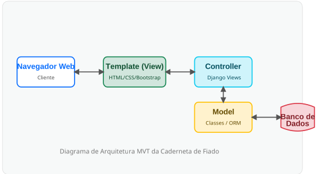

# Projeto Arquitetura de Software

## Caderneta de Dívidas

**Equipe:** Arthur, Expedito, Júlia, Gean, Ivyson  
**Data:** 09 de Maio de 2026

---

# Fundamentação

A arquitetura do sistema foi fundamentada no padrão **MVT (Model-View-Template)** nativo do framework **Django**. A decisão por este design justifica-se pela necessidade de um desenvolvimento ágil e seguro, conforme os riscos identificados no Documento de Visão.

- **Arquitetura Monolítica:** Optou-se por uma estrutura monolítica em vez de microserviços para reduzir a complexidade de rede e facilitar a consistência de dados em transações críticas, como o registro de pagamentos (US03).

- **ORM (Object-Relational Mapping):** O uso do Django ORM isola a camada de dados, protegendo o sistema contra injeções de SQL e garantindo a portabilidade entre diferentes bancos de dados relacionais.

---

# Visão Geral da Arquitetura

O sistema **Caderneta de Dívidas** foi desenvolvido utilizando o framework web **Django (Python)**.

Por isso, a arquitetura geral segue o padrão estrutural **MVT (Model-View-Template)**, que atua como uma variação robusta e direta do clássico **MVC (Model-View-Controller)**.

Abaixo é apresentada a imagem representando o fluxo de dados e as camadas da arquitetura implementada no projeto.

## Diagrama de Arquitetura MVT da Caderneta de Fiado

---

# Componentes da Arquitetura

Abaixo detalhamos a responsabilidade de cada componente mapeado no diagrama, evidenciando como eles se conectam para atender aos requisitos de Manter Cliente, Dívidas, Pagamentos e Relatórios.

| Componente | Responsabilidade |
|------------|------------------|
| **Navegador Web (Cliente)** | Ponto de acesso do usuário (Comerciante ou Administrador). É responsável por renderizar a interface e enviar requisições HTTP (GET/POST) ao servidor. |
| **Template (Visão Front-end)** | Representa os arquivos `.html` (ex.: `cadastrar_cliente.html`, `registrar_pagamento.html`). Formata as respostas enviadas pelo backend e gerencia a usabilidade e navegação utilizando HTML, CSS customizado e Bootstrap. |
| **Controller (Django Views)** | É o cérebro da aplicação (`views.py`). Recebe as interações do Template, processa regras de negócio (como cálculo de saldo restante na US03 e filtros para US08), solicita dados ao Model e retorna a resposta formatada ao usuário. |
| **Model (Domínio e ORM)** | Representado pelo arquivo `models.py`. Contém as classes estruturais do sistema (Cliente, Dívida, Pagamento e Endereço). Utiliza o ORM do Django para traduzir a lógica orientada a objetos em consultas SQL de forma segura. |
| **Banco de Dados** | Camada de persistência que armazena fisicamente o histórico de dívidas, cadastros de clientes e recibos de pagamentos. Garante que os dados sejam salvos permanentemente para a geração dos relatórios. |

---

# Decisões de Design e Tecnologias

- **Arquitetura Monolítica e Framework Django**

  Escolhida pela alta coesão e velocidade de desenvolvimento. O uso do ORM embutido dispensa consultas SQL manuais, minimizando erros e atendendo aos prazos do projeto.

- **Estilização com Bootstrap**

  Garante responsividade e padronização visual nas telas de cadastro e relatórios, cumprindo as exigências de usabilidade da equipe.

- **Separação de Preocupações (SoC)**

  A separação clara entre Template, View e Model permite que membros diferentes da equipe (por exemplo, Gean testando, Arthur desenvolvendo views e Expedito no banco de dados) atuem simultaneamente no projeto com o mínimo de conflitos de código.

---

# Visão de Casos de Uso

Os itens abaixo representam as funcionalidades críticas (User Stories) que validam a robustez da arquitetura proposta.

| User Story | Motivo da Escolha para Validação Arquitetural |
|------------|-----------------------------------------------|
| **US01 - Manter Cliente** | Valida o fluxo básico de CRUD (Create, Read, Update e Delete) do padrão MVT e a persistência em múltiplas tabelas simultaneamente de forma íntegra (por exemplo, salvar Cliente e Endereço associado). |
| **US02 - Manter Dívida** | Valida o relacionamento entre diferentes entidades no banco de dados e as validações das regras de domínio. |
| **US03 - Controlar Pagamento** | Testa a consistência do banco de dados e a necessidade de utilizar transações atômicas para garantir que os pagamentos atualizem os saldos remanescentes das dívidas sem falhas. |
| **US04 - Gerar Relatório de Pagamento** | Valida as rotinas de leitura e a aplicação de filtros condicionais do ORM, testando a resposta da visualização de listas filtradas. |
| **US05 - Gerar Relatório de Histórico de Dívidas** | Avalia a capacidade do sistema e do banco de dados de cruzar informações complexas ligando Clientes, Dívidas e o respectivo Histórico de Pagamentos de forma simultânea e performática. |
| **US06 - Gerar Relatórios Mensais de Dívidas** | Testa as rotinas de agregação de dados, exportação de arquivos e processamento de filtros no banco de dados com foco em janelas de tempo específicas. |
| **US07 - Emitir Alerta de Limite de Dívida** | Valida a implementação de regras de negócio preventivas, onde o sistema realiza um cálculo em tempo real que funciona como gatilho de alerta antes de permitir uma nova persistência no banco. |
| **US08 - Emitir Alerta de Inadimplência** | Exercita a capacidade de filtragem do Controller baseada na manipulação e comparação de datas dinâmicas (data de vencimento registrada versus data atual do servidor), combinada à checagem do status pendente. |

---