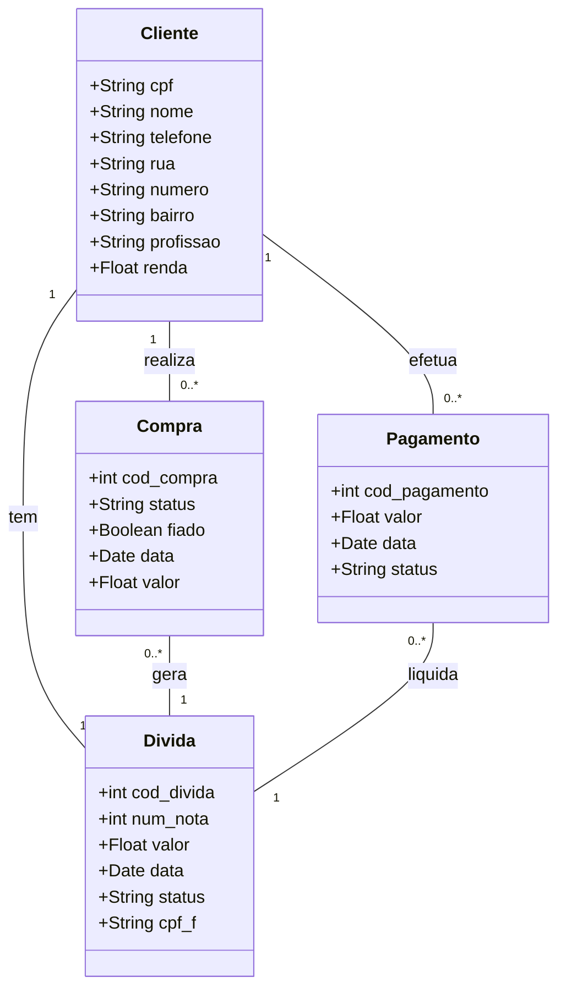
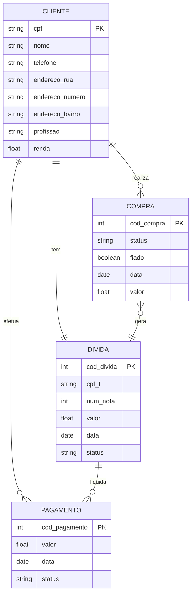

# Modelo Conceitual

# Modelo de Dados (Entidade-Relacionamento)

### Dicionário de Dados

|   Tabela   |   Cliente   |
| ---------- | ----------- |
| Descrição  | Armazena as informações de um cliente. |

|  Nome         | Descrição                        | Tipo de Dado | Tamanho | Restrições de Domínio |
| ------------- | -------------------------------- | ------------ | ------- | --------------------- |
| CPF           | Número do CPF do cliente         | VARCHAR      | 15      | PK / Identity         |
| Nome          | Nome cliente                     | VARCHAR      | 100     | Not Null              |
| Telefone      | Telefone do cliente              | VARCHAR      | 16      | Not Null              |
| Rua           | Nome da rua                      | VARCHAR      | 100     | Not Null              |
| Número        | Número da residência             | VARCHAR      | 6       |          ---          |
| Bairro        | Bairro onde o cliente reside     | VARCHAR      | 50      | Not Null              |
| Profissão     | Profissão do cliente             | VARCHAR      | 100     | Not Null              |
| Renda         | Renda bruta do cliente           | Float        |   ---   | Not Null              |